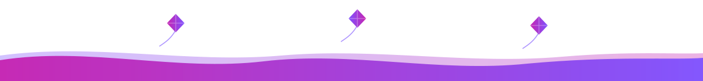

<!-- ══════════════════════  HEADER  ══════════════════════ -->

<picture>
  <source media="(prefers-color-scheme: dark)" srcset="assets/hero-dark.svg">
  
</picture>

 

<!-- ══════════════════════  FEATURED  ══════════════════════ -->

<h3 align="center">⭐ Featured</h3>

<table align="center"><tr><td width="620" valign="top">

### 📱 [syncplay-mobile](https://github.com/yuroyami/syncplay-mobile) &nbsp;

A Syncplay client for **Android + iOS** — watch video in sync with friends, 100% Kotlin & Compose. The codebase the kmp-ssot pattern grew out of.

  

</td></tr></table>

<!-- ══════════════════════  KITE LINEAGE  ══════════════════════ -->

## 🪁 &nbsp;Kite — the work I'm proudest of

> These are the libraries I keep coming back to. Each one does something from common Kotlin that the ecosystem swore meant dropping to C, Java, or a platform SDK. Most are pure ports with nothing native underneath; where a native core is unavoidable, Kite hides it behind the same Kotlin API. I build them because I'd rather trust Kotlin than route around it — and every time, it holds. One name, one belief: **Kotlin is enough.**

<table>
<tr>
<td width="50%" valign="top">

### [KitePDF](https://github.com/yuroyami/KitePDF)
Read · view · render · edit · create PDFs. One engine — no PDFKit, PdfRenderer, or pdf.js.

   

</td>
<td width="50%" valign="top">

### [kmp-ssot](https://github.com/yuroyami/kmp-ssot) &nbsp;🧰
Gradle plugin — declare `appName` / `version` / `bundleId` once, propagate to Android + iOS.

</td>
</tr>
<tr>
<td width="50%" valign="top">

### KiteTorrent
Port of libtorrent 2.0 — download, seed, magnets. Runs **on iOS**, where libtorrent never went.

</td>
<td width="50%" valign="top">

### KiteQR
Full ZXing core port. Every symbology, CJK/Shift_JIS ECI, SVG/PNG out, Compose bindings.

</td>
</tr>
<tr>
<td width="50%" valign="top">

### KiteArchive
DEFLATE · gzip · zlib · tar · checksums. Stdlib-only core, kotlinx-io adapter.

</td>
<td width="50%" valign="top">

### KiteCodec
One coroutine-first API for audio + video — decode, encode, transcode, filter — from common Kotlin, backed by FFmpeg.

</td>
</tr>
<tr>
<td width="50%" valign="top">

### KiteCore
Runtime gap-closer for KMP — real IO dispatchers + inline web-worker offload.

</td>
<td width="50%" valign="top">

### Kite3D
A pure-Kotlin 3D engine for KMP, rising from its math core.

</td>
</tr>
</table>

<!-- ══════════════════════  "y" APPS  ══════════════════════ -->

## ✌️ &nbsp;the "y" apps — because my name has two

<table>
<tr>
<td width="33%" valign="top" align="center">

### [Jetzy](https://github.com/yuroyami/jetzy)
Cross-platform file transfer.

 

</td>
<td width="33%" valign="top" align="center">

### [Pingy](https://github.com/yuroyami/PINGY)
Network ping / latency tester.

 

</td>
<td width="33%" valign="top" align="center">

### Luddy
Torrent + HTTP downloader. iOS torrents via KiteTorrent.

</td>
</tr>
</table>

<!-- ══════════════════════  THE FLEX  ══════════════════════ -->

#### Almost every line I write is Kotlin

<i>The rest is Swift — iOS interop, where the OS insists.</i>

<!-- ══════════════════════  CONTACT  ══════════════════════ -->

 

