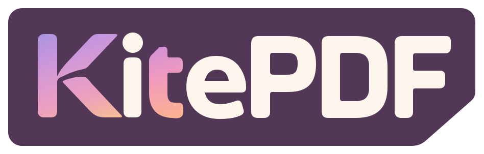
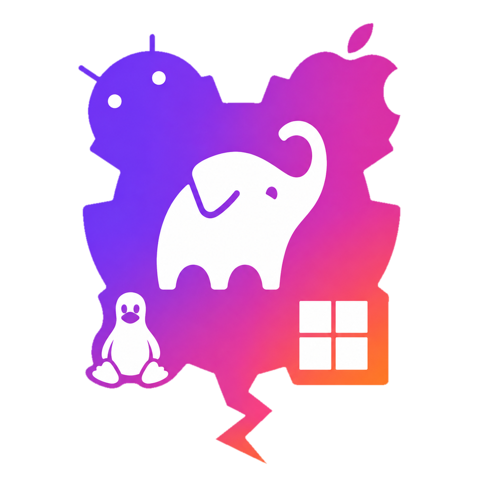

<picture>
  <source media="(prefers-color-scheme: dark)" srcset="assets/hero-dark.svg">
  
</picture>

I write everything in Kotlin. With Kotlin Multiplatform (KMP), one codebase
runs on Android, iOS, desktop, and web: you share the logic, and every platform
still gets native performance. I expect it to become the default way to build
cross-platform apps.

## Why I write the Kite libraries

Every Kite library is one of two things. Either a full Kotlin port of an
existing library, like KiteTorrent which ports libtorrent. Or a Kotlin/Native
cockpit over a native core, like KiteFFmpeg which drives FFmpeg in a
Kotlin-first, coroutine-first way. The goal is to depend on nothing if I can
help it. No bundled third-party library and no outside API. So when a bug shows
up it is the Kite library's own bug, and it gets fixed there.

It also means every Kite library behaves exactly the same on every platform,
because there is no expect/actual split underneath, or almost none. Most of
the code is Kotlin/Native, and sometimes all of it is.

I also want the Kite libraries to fit into the KMP world on the rendering side.
So wherever it makes sense there are Compose bindings and renderers. KitePDF,
KitePlayer and Kite3D all have them.

## Featured

<table align="left">
<tr><td align="center" width="380">
 
  
<b><a href="https://github.com/yuroyami/syncplay-mobile">Synkplay</a></b>  
   
Watch videos in sync with friends, in the same rooms as Syncplay for PC. Android and iOS.
  
</td></tr>
</table>

<table align="right">
<tr><td align="center" width="380">
 
  
<b><a href="https://github.com/yuroyami/KitePDF">KitePDF</a></b>  
   
Read, write, create, and display PDFs and EPUB books. Pure Kotlin, on Android, iOS, desktop, and web.
  
</td></tr>
</table>

 

<table align="left">
<tr><td align="center" width="380">
 
&nbsp;&nbsp;&nbsp;&nbsp;  
<b><a href="https://github.com/yuroyami/KitePlayer">KitePlayer</a></b> + <b><a href="https://github.com/yuroyami/KiteFFmpeg">KiteFFmpeg</a></b>  
    
Twins. KiteFFmpeg is FFmpeg as a plain Kotlin dependency: convert, trim, and transcode video and audio. One Gradle line, no NDK, no install. KitePlayer is the media player built on it, with a 100% Kotlin core: subtitles, live streams, hardware decode.
  
</td></tr>
</table>

<table align="right">
<tr><td align="center" width="380">
 
  
<b><a href="https://github.com/yuroyami/KiteConfig">KiteConfig</a></b>  
   
Set your app name, logo, version, and IDs once, in one Gradle block. Android and iOS both read from it, so they never drift apart.
  
</td></tr>
</table>

 

## Upcoming Kite libraries

All of these exist and build. None is tested enough to trust yet, so their
repos stay private. Each one goes public once it proves it works.

| Library | Purpose |
| :--- | :--- |
| **KiteImage** | Load and save images (PNG, JPEG, GIF, WebP, and more) from shared code. |
| **KiteQR** | Scan and create QR codes and barcodes. |
| **KiteCore** | The small helpers every project rewrites: text, lists, dates, math, and coroutines. |
| **KiteArchive** | Zip and unzip anywhere, plus TAR, gzip, LZ4, and Snappy. |
| **KiteAudio** | Decode, encode, and tag audio files. |
| **Kite3D** | 3D math: vectors, matrices, quaternions, and collision shapes. |
| **KiteSynth** | A synthesizer: it reads a SoundFont, takes MIDI notes, and turns them into sound. |
| **KiteRT** | Real-time audio output. Your code makes the samples, KiteRT gets them to the speakers. |
| **KiteMIDI** | Read and write MIDI files, and talk to real instruments over USB and Bluetooth. |
| **KiteTorrent** | Download and seed torrents from shared code: magnet links, encryption, peer discovery. |

## Upcoming apps

Bigger things in the works, each one a single Kotlin codebase for every platform.

| App | Purpose |
| :--- | :--- |
| **PINGETTO** | Check your network latency with ping. |
| **Luddy** | One download manager for every screen: torrents and direct links, streamed while they download. |
| **ChatStrata** | Read the chat backups you download from Facebook, Instagram, Snapchat, and others. |
| **Peerora** | Send files between your devices. |

 

