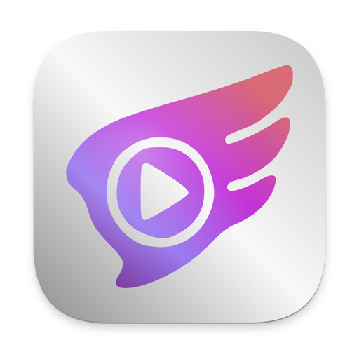
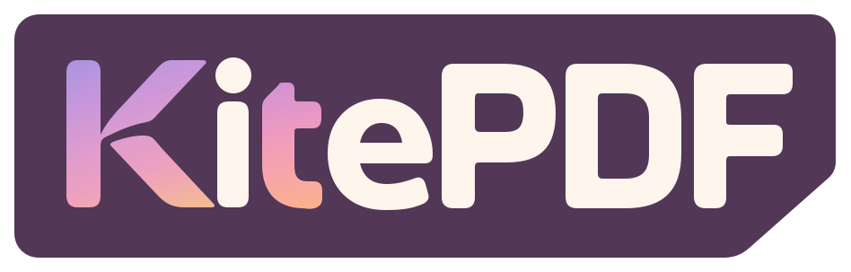
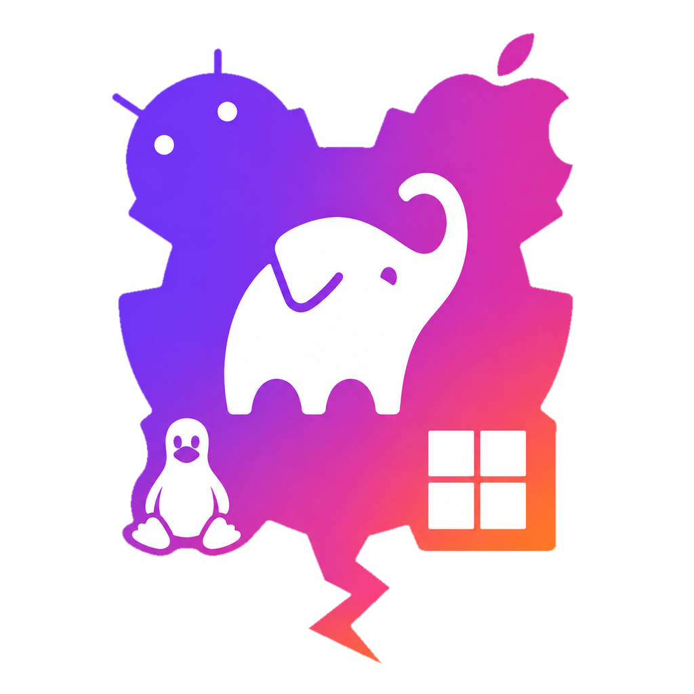

<picture>
  <source media="(prefers-color-scheme: dark)" srcset="assets/hero-dark.svg">
  
</picture>

## Why I write the Kite libraries

Kite is my family of Kotlin Multiplatform libraries. Most of them are one of
two kinds. Some rewrite an existing library in Kotlin, like KiteTorrent does
with libtorrent. Others put a Kotlin API on top of a native core.
[KiteFFmpeg](https://github.com/yuroyami/KiteFFmpeg) does this for FFmpeg, so
you call FFmpeg through suspend functions instead of a command line.

Either way, I try to depend on as little as possible, and I aim for zero
`expect`/`actual` declarations. A Kite library does its own work instead of
handing it to a platform library, like ExoPlayer on Android or AVPlayer on iOS.
When it needs native code, that code ships inside the library, so there is
nothing else to install.

This means that when something breaks, the bug is in the library itself, where
I can fix it. It is not hidden in a platform library that I cannot change. And
because the same code does the work on every platform, a Kite library behaves
the same everywhere.

Now that Compose Multiplatform exists, I see no reason to choose Flutter or
React Native. So I want the libraries to fit into Compose apps, and where it
makes sense, a library comes with Compose UI.
[KitePDF](https://github.com/yuroyami/KitePDF) has one composable for every
document format it opens, and
[KitePlayer](https://github.com/yuroyami/KitePlayer) has a Compose video view.

## Featured

<table align="left">
<tr><td align="center" width="380">
 
  
<b><a href="https://github.com/yuroyami/syncplay-mobile">Synkplay</a></b>  
   
Watch videos in sync with friends on Android and iOS. Anyone on a computer can join the same room with Syncplay.
  
</td></tr>
</table>

<table align="right">
<tr><td align="center" width="380">
 
  
<b><a href="https://github.com/yuroyami/KitePDF">KitePDF</a></b>  
   
Read, create, edit, and display PDFs, and open EPUB books. It is pure Kotlin, so the same code runs on Android, iOS, desktop, and the web.
  
</td></tr>
</table>

 

<table align="left">
<tr><td align="center" width="380">
 
&nbsp;&nbsp;&nbsp;&nbsp;  
<b><a href="https://github.com/yuroyami/KitePlayer">KitePlayer</a></b> + <b><a href="https://github.com/yuroyami/KiteFFmpeg">KiteFFmpeg</a></b>  
    
KiteFFmpeg adds FFmpeg to your project as one Gradle dependency, with no NDK and nothing to install. Use it to convert, trim, and transcode video and audio. KitePlayer is a media player built on KiteFFmpeg. Its core is 100% Kotlin, so it plays the same on every platform. It supports subtitles, live streams, and hardware decoding.
  
</td></tr>
</table>

<table align="right">
<tr><td align="center" width="380">
 
  
<b><a href="https://github.com/yuroyami/KiteConfig">KiteConfig</a></b>  
   
Set your app name, icon, version, and IDs once, in one Gradle block. Android, iOS, and desktop all read from it, so they never drift apart.
  
</td></tr>
</table>

 

## Upcoming Kite libraries

These libraries all exist and build, but I have not tested them enough to trust
them yet. Each one stays private until it proves that it works, and then it
goes public.

| Library | Purpose |
| :--- | :--- |
| **KiteImage** | Load and save images (PNG, JPEG, GIF, WebP, and more) from shared code. |
| **KiteQR** | Scan and create QR codes and barcodes. |
| **KiteCore** | The small helpers every project rewrites: text, lists, dates, math, and coroutines. |
| **KiteArchive** | Zip and unzip anywhere, plus TAR, gzip, LZ4, and Snappy. |
| **KiteAudio** | Decode, encode, and tag audio files. |
| **Kite3D** | 3D math: vectors, matrices, quaternions, and collision shapes. |
| **KiteSynth** | A synthesizer: it reads a SoundFont, takes MIDI notes, and turns them into sound. |
| **KiteRT** | Real-time audio output. Your code makes the samples, and KiteRT sends them to the speakers. |
| **KiteMIDI** | Read and write MIDI files, and talk to real instruments over USB and Bluetooth. |
| **KiteTorrent** | Download and seed torrents from shared code: magnet links, encryption, peer discovery. |

## Upcoming apps

These are the apps I am working on now. Each one runs on every platform from a single Kotlin codebase.

| App | Purpose |
| :--- | :--- |
| **PINGETTO** | Check your network latency with ping. |
| **Luddy** | One download manager for every screen: torrents and direct links, streamed while they download. |
| **ChatStrata** | Read the chat backups you download from Facebook, Instagram, Snapchat, and others. |
| **Peerora** | Send files between your devices. |

 

